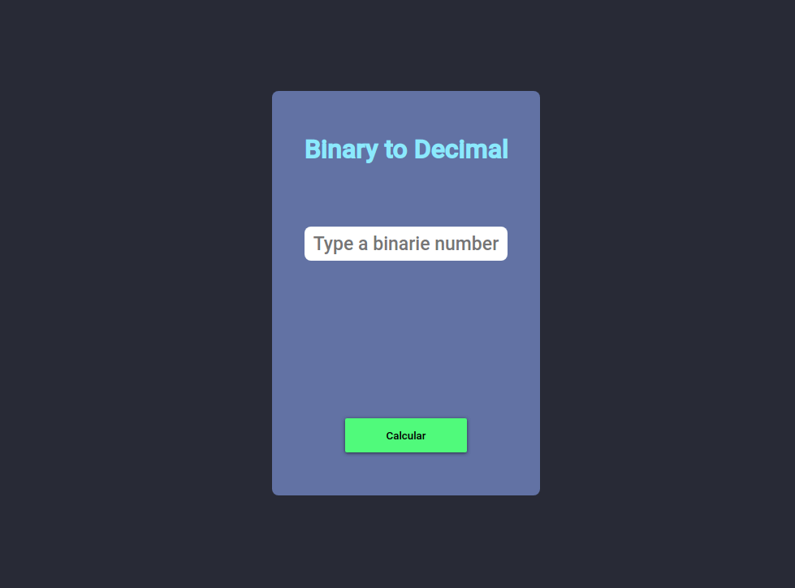

# Binário para Decimal

## :books: Projeto

Esse pequeno projeto converte números binários em decimais utilizando Javascript

## :computer: Tecnologias

Foram usadas as seguintes tcnologias neste projeto:

- HTML + Flexbox
- CSS
- Javascript

## :smiley: Como vizualizar?

Basta Acessar esse link:

[Binário para Decimal](https://pedromartinscap.github.io/binary-to-decimal/)

## :clap: Créditos
  ### Idealização

  [Bin2Dec-App](https://github.com/florinpop17/app-ideas/blob/master/Projects/1-Beginner/Bin2Dec-App.md)

Feito com :blue_heart: por [Pedro Henrique](https://www.linkedin.com/in/pedrohenriqueoliveiramartins/)
